# BookSwap Hub - UML Class Diagram

```mermaid
classDiagram
    direction LR

    class User {
      -Long id
      -String username
      -String email
      -String password
      -String role
      -LocalDateTime createdAt
      +prePersist() void
      +getId() Long
      +getUsername() String
      +getEmail() String
      +getRole() String
    }

    class Book {
      -Long id
      -String title
      -String author
      -String description
      -BigDecimal price
      -byte[] imageData
      -String imageType
      -BookCategory category
      -BookCondition condition
      -Double latitude
      -Double longitude
      -String address
      -boolean sold
      -LocalDateTime createdAt
      +hasImage() boolean
      +prePersist() void
      +isSold() boolean
      +setSold(boolean) void
    }

    class PurchaseRequest {
      -Long id
      -String message
      -RequestStatus status
      -LocalDateTime createdAt
      +prePersist() void
      +getStatus() RequestStatus
      +setStatus(RequestStatus) void
    }

    class ChatMessage {
      -Long id
      -String content
      -LocalDateTime sentAt
      +prePersist() void
      +getContent() String
      +setContent(String) void
    }

    class Wishlist {
      -Long id
      -LocalDateTime savedAt
      +prePersist() void
    }

    class Notification {
      -Long id
      -String message
      -boolean read
      -LocalDateTime createdAt
      +prePersist() void
      +isRead() boolean
      +setRead(boolean) void
    }

    class BookCategory {
      <<enumeration>>
      FICTION
      NON_FICTION
      SCIENCE
      HISTORY
      TECHNOLOGY
      CHILDREN
      BIOGRAPHY
      SELF_HELP
      OTHER
      +getDisplayName() String
    }

    class BookCondition {
      <<enumeration>>
      NEW
      LIKE_NEW
      OLD
      +getDisplayName() String
    }

    class RequestStatus {
      <<enumeration>>
      PENDING
      APPROVED
      REJECTED
    }

    class UserRepository {
      <<interface>>
      +findByUsername(String) Optional~User~
      +findByEmail(String) Optional~User~
      +existsByUsername(String) boolean
      +existsByEmail(String) boolean
    }

    class BookRepository {
      <<interface>>
      +findBySoldFalseOrderByCreatedAtDesc() List~Book~
      +findByOwnerOrderByCreatedAtDesc(User) List~Book~
      +findBySoldFalseAndOwnerNotOrderByCreatedAtDesc(User) List~Book~
    }

    class PurchaseRequestRepository {
      <<interface>>
      +findByRequesterOrderByCreatedAtDesc(User) List~PurchaseRequest~
      +findByBookOwnerOrderByCreatedAtDesc(User) List~PurchaseRequest~
      +existsByBookAndRequester(Book, User) boolean
    }

    class ChatMessageRepository {
      <<interface>>
      +findByRequestOrderBySentAtAsc(PurchaseRequest) List~ChatMessage~
      +findByRequestAndIdGreaterThanOrderBySentAtAsc(PurchaseRequest, Long) List~ChatMessage~
    }

    class WishlistRepository {
      <<interface>>
      +existsByUserAndBook(User, Book) boolean
      +findByUserOrderBySavedAtDesc(User) List~Wishlist~
    }

    class NotificationRepository {
      <<interface>>
      +findByRecipientOrderByCreatedAtDesc(User) List~Notification~
      +countByRecipientAndReadFalse(User) long
    }

    class UserService {
      +loadUserByUsername(String) UserDetails
      +registerUser(String, String, String) User
    }

    class BookService {
      +getAllUnsoldBooks() List~Book~
      +searchBooks(String, BookCategory, BookCondition, BigDecimal, BigDecimal, String) List~Book~
      +createBook(...) Book
      +updateBook(...) Book
      +deleteBook(long, User) void
      +markAsSold(long, User) void
      +calculateDistance(double,double,double,double) double
    }

    class PurchaseRequestService {
      +sendRequest(Book, User, String) PurchaseRequest
      +getRequestsByUser(User) List~PurchaseRequest~
      +getRequestsForOwner(User) List~PurchaseRequest~
      +approveRequest(long, User) void
      +rejectRequest(long, User) void
    }

    class WishlistService {
      +saveBook(User, Book) void
      +removeBook(User, Book) void
      +toggleWishlist(User, Book) boolean
      +isWishlisted(User, Book) boolean
    }

    class NotificationService {
      +sendNotification(User, String) void
      +getNotificationsForUser(User) List~Notification~
      +getUnreadCount(User) long
      +markAllRead(User) void
    }

    class AuthController {
      +adminLoginPage(String, Model) String
      +adminLoginSubmit(String, String, HttpServletRequest, RedirectAttributes) String
      +loginPage(String, String, Model) String
      +registerUser(String, String, String, String, RedirectAttributes) String
    }

    class BookController {
      +listBooks(...) String
      +bookDetail(Long, Authentication, Model) String
      +uploadBook(...) String
      +updateBook(...) String
      +deleteBook(Long, Authentication, RedirectAttributes) String
      +markSold(Long, Authentication, RedirectAttributes) String
      +myListings(Authentication, Model) String
    }

    class PurchaseRequestController {
      +sendRequest(Long, String, Authentication, RedirectAttributes) String
      +myRequests(Authentication, Model) String
      +ownerRequests(Authentication, Model) String
      +approveRequest(Long, Authentication, RedirectAttributes) String
      +rejectRequest(Long, Authentication, RedirectAttributes) String
    }

    class ChatController {
      +chatPage(long, Authentication, Model) String
      +sendMessage(long, String, Authentication) ResponseEntity
      +pollMessages(long, Long, Authentication) ResponseEntity
    }

    class NotificationController {
      +notificationsPage(Authentication, Model) String
    }

    class WishlistController {
      +wishlistPage(Authentication, Model) String
      +toggleWishlist(Long, Authentication, RedirectAttributes) String
    }

    class AdminController {
      +panel(Model) String
      +deleteBook(long, RedirectAttributes) String
      +updateBook(...) String
      +deleteUser(long, RedirectAttributes) String
    }

    %% ===== Domain Relationships (Cardinality + Composition/Aggregation) =====
    User "1" o-- "0..*" Book : owns
    User "1" o-- "0..*" PurchaseRequest : makes
    User "1" o-- "0..*" Notification : receives
    User "1" o-- "0..*" ChatMessage : sends

    Book "1" *-- "0..*" PurchaseRequest : composition\n(cascade=ALL, orphanRemoval=true)
    PurchaseRequest "1" *-- "0..*" ChatMessage : composition\n(cascade=ALL, orphanRemoval=true)

    User "1" o-- "0..*" Wishlist : aggregation
    Book "1" o-- "0..*" Wishlist : aggregation

    Book --> BookCategory : category
    Book --> BookCondition : condition
    PurchaseRequest --> RequestStatus : status

    PurchaseRequest "*" --> "1" Book : book
    PurchaseRequest "*" --> "1" User : requester
    ChatMessage "*" --> "1" PurchaseRequest : request
    ChatMessage "*" --> "1" User : sender
    Wishlist "*" --> "1" User : user
    Wishlist "*" --> "1" Book : book
    Notification "*" --> "1" User : recipient

    %% ===== Repository bindings =====
    UserRepository ..> User : persists
    BookRepository ..> Book : persists
    PurchaseRequestRepository ..> PurchaseRequest : persists
    ChatMessageRepository ..> ChatMessage : persists
    WishlistRepository ..> Wishlist : persists
    NotificationRepository ..> Notification : persists

    %% ===== Service dependencies =====
    UserService --> UserRepository
    BookService --> BookRepository
    PurchaseRequestService --> PurchaseRequestRepository
    PurchaseRequestService --> NotificationService
    WishlistService --> WishlistRepository
    NotificationService --> NotificationRepository

    %% ===== Controller dependencies =====
    AuthController --> UserService
    BookController --> BookService
    BookController --> PurchaseRequestService
    BookController --> WishlistService
    BookController --> UserRepository
    PurchaseRequestController --> PurchaseRequestService
    PurchaseRequestController --> BookService
    PurchaseRequestController --> UserRepository
    ChatController --> ChatMessageRepository
    ChatController --> PurchaseRequestRepository
    ChatController --> UserRepository
    NotificationController --> NotificationService
    NotificationController --> UserRepository
    WishlistController --> WishlistService
    WishlistController --> BookService
    WishlistController --> UserRepository
    AdminController --> UserRepository
    AdminController --> BookRepository
    AdminController --> PurchaseRequestRepository
```

## Notes
- `*--` denotes **composition** (strong ownership / shared lifecycle).
- `o--` denotes **aggregation** (weak ownership / independent lifecycle).
- Cardinality labels reflect JPA mappings in model classes.
